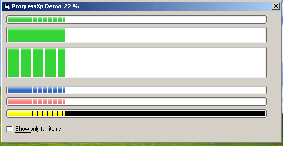



## ProgressXp \(Standalone Usercontrol\) Part 2

### Description

Takes Thorben Linneweber's old XP Progress control to the next level. You can now specify a height, background and bar color.
 
### More Info
 

             |
---                |---
**Submitted On**   |2005-08-11 18:28:04
**By**             |[Kevin Smithwick](https://github.com/Planet-Source-Code/PSCIndex/blob/master/ByAuthor/kevin-smithwick.md)
**Level**          |Advanced
**User Rating**    |4.5 (18 globes from 4 users)
**Compatibility**  |VB 6\.0
**Category**       |[Miscellaneous](https://github.com/Planet-Source-Code/PSCIndex/blob/master/ByCategory/miscellaneous__1-1.md)
**World**          |[Visual Basic](https://github.com/Planet-Source-Code/PSCIndex/blob/master/ByWorld/visual-basic.md)
**Archive File**   |[ProgressXp1923128112005\.zip](https://github.com/Planet-Source-Code/kevin-smithwick-progressxp-standalone-usercontrol-part-2__1-62155/archive/master.zip)

